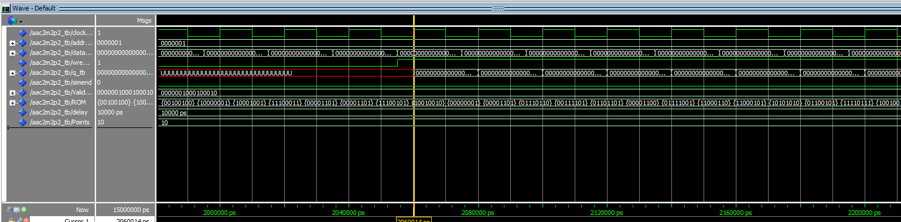

<p align="center">
  
</p>

---

# 🧠 128×32 Single-Port RAM in VHDL

[]()
[]()
[]()
[]()

---

## 📘 Overview

This project implements a **128-word × 32-bit single-port RAM** in **VHDL**.  
It supports **synchronous write** and **asynchronous read** operations, following a typical FPGA-style behavioral model.

The design was verified with a custom testbench using **ModelSim–Intel FPGA Edition 10.5b**.

---

## 🌟 Entity Declaration

```vhdl
ENTITY RAM128_32 IS
  PORT (
    address : IN  STD_LOGIC_VECTOR (6 DOWNTO 0);
    clock   : IN  STD_LOGIC := '1';
    data    : IN  STD_LOGIC_VECTOR (31 DOWNTO 0);
    wren    : IN  STD_LOGIC;
    q       : OUT STD_LOGIC_VECTOR (31 DOWNTO 0)
  );
END RAM128_32;
---

## 🧠 Simulation Result

<p align="center">
  
</p>

<p align="center"><i>Figure 1. Simulation waveform of the 128×32 Single-Port RAM showing write and read operations.</i></p>

---

## 🧑‍💻 Author  
**Derrick Smith**  
Lexmark (a Xerox Subsidiary) – Electrical Engineer  

<p align="center">
  
  
  
</p>

---

<p align="center">
  © 2025 Derrick Smith. Released under the MIT License.
</p>
